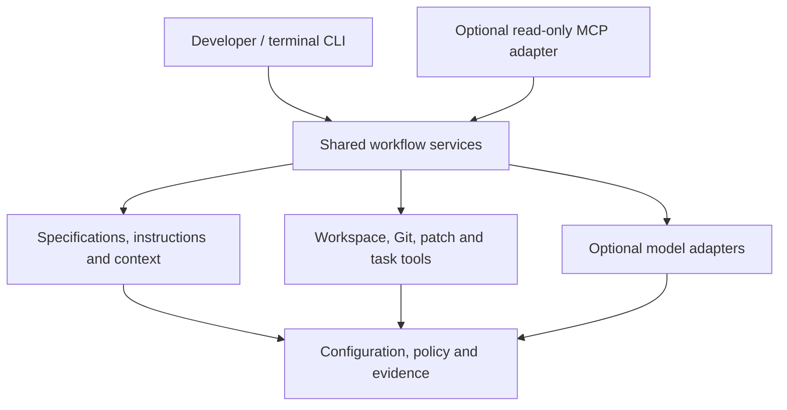

# Portable AI Harness — Architecture and core interfaces

Design revision: 1  
Checkpoint: Step 03B, section 1  
Date: 7 October 2026  
Status: proposed architecture for review; no implementation claims.

The approved first-release contract is [release-scope.md](release-scope.md), merged into main at commit `96cc799`. This document defines the harness boundary and shared interfaces. Exact schemas, CLI signatures and the wider RelayCart architecture are subsequent Step 03B sections.

## Architecture decision

Build one local Python package with modular internal components, a CLI entry point and an optional read-only MCP entry point. It is an independent developer tool, not a hosted application service or an application dependency. Keep the user-facing CLI small by grouping feature, context, development, validation and configuration operations.

Both entry points call shared application services; neither duplicates path checks or domain logic. The CLI can invoke reviewed mutation/execution workflows. The initial MCP adapter exposes a smaller read-only surface, not all CLI functions. IDE/assistant integrations invoke these public interfaces or use explicitly exported context.

Policy validation is invoked before sensitive actions; the diagram's shared dependency does not imply checks happen only afterward. MCP traffic stays on protocol stdout; operational logs use stderr. No model is required for project inspection or deterministic checks.

## Component responsibilities

| Component | Owns | Does not own |
|---|---|---|
| Entry adapters | CLI parsing, local interaction, MCP transport and output formatting | Provider behaviour or duplicated safeguards |
| Workflow services | Feature/context/plan/propose/apply/check/review sequencing and checkpoint decisions | An unattended retry/agent loop |
| Configuration and policy | Schema validation, workspace restrictions, profiles, limits and explicit operation rules | An OS sandbox or permission to override host controls |
| Feature and instruction services | Feature metadata, acceptance IDs, selected project guidance and versioned prompt packs | Automatic interpretation of every external specification format |
| Context service | Selected files/diffs/docs, exclusions, instruction composition and budgets | Indexing the entire machine or silent remote upload |
| Workspace and patch tools | Safe file access, expected-state validation, reviewed changes and recovery records | Arbitrary shell execution or overwriting intervening edits |
| Git checkpoint service | Status, reviewed local file selection, optional commit and source-state metadata | Automatic push, reset, stash or discard |
| Task service | Trusted named argv tasks, lifecycle, output/time limits and actual exit outcomes | Treating configured programs as sandboxed or letting model prose become commands |
| Provider adapters | Provider transport, supported settings, counting/capabilities and normalized responses | Project filesystem authority or changing workflow policy |
| Evidence service | Redacted structured events/reports and feature-to-check links | Making acceptance claims from generated prose |

## Shared interface contracts

Use validated internal data objects. CLI/MCP/provider representations map into these objects; provider SDK types do not spread through the core. Field names below are design contracts, not implemented API signatures.

| Contract | Minimum contents and behaviour |
|---|---|
| `ProjectConfig` | Schema version, root, profiles, tasks, policy references, prompt/model profiles and limits; secrets referenced by environment-variable name only |
| `FeatureSpec` | ID, outcome, acceptance IDs, constraints, selected context, related components and named checks; linked Markdown may hold narrative |
| `ContextBundle` | Selected inputs, content hashes, source state, instruction/prompt versions, exclusions, byte counts and counted/estimated token budget |
| `ModelRequest` | Profile/model, composed messages, output budget, timeout and required capabilities; no filesystem/subprocess tools in the direct-model request |
| `ModelResponse` | Text or validated proposal payload, provider/model, finish/error status, latency and available usage; no inferred success flags |
| `ChangeSet` | Schema version, workspace identity, feature/run ID, proposed file operations, expected original hashes, proposed content and reviewable diff |
| `TaskResult` | Task identity, command/executable metadata, timing, exit/timeout status and bounded redacted excerpts |
| `RunReport` | Versions, run/feature IDs, spec/context/change hashes, commit plus working-tree fingerprints, task outcomes and acceptance-evidence links |

The first change-set format supports bounded text-file create/update operations, including tests. Delete operations, binary files, permissions changes, symlink changes and Git metadata edits are denied initially unless separately designed and tested. An executable proposal contains file data only. A model-generated test is source code: running it still executes trusted project code and requires a reviewed task invocation.

Provider capabilities distinguish unsupported, supported and unverified features. Reject incompatible settings or request an explicit alternative. No silent model/provider fallback. An estimate is labelled and uses configured headroom; provider-reported usage is retained separately. Remote counting and inference require an explicit network action.

## Two development routes, one acceptance workflow

### Assistant-led

The developer selects a feature/request and prepares context through the harness. The chosen assistant receives that context through a supported integration, MCP or manual export, then edits with its own facilities. The developer reviews the diff and explicitly invokes harness checks/review. Record which route was used and source state around it.

An external assistant can act outside harness tools. Its native filesystem permissions and approvals remain its own boundary. The harness cannot claim to prevent those actions or enforce a prompt instruction as an OS control. Final results are re-inspected through the shared tools.

### Harness-led

1. Inspect repository state and offer a checkpoint according to policy.
2. Compose and preview selected context, instructions, destination and budget.
3. Invoke one explicitly selected provider to propose a plan or change set.
4. Validate the response format and preview proposed file changes.
5. Obtain explicit local approval bound to the reviewed change-set hash.
6. Revalidate allowed paths and expected file hashes immediately before applying.
7. Apply through the patch service; review the resulting diff.
8. Explicitly run selected named checks, optionally request AI review, then let the developer accept or revise.

An `approved: true` field in a model response is never approval. Changed proposals need renewed review. Stop on failed checks and present results; do not launch an unbounded repair loop. Plan generation and implementation are distinct actions, so a user can review reasoning before paying for another call.

## File safety and recovery

Normalize/canonicalize paths, reject absolute/outside-root and denied paths, and check symlink components. Keep the first implementation single-writer and revalidate at apply time; document residual concurrent-filesystem limitations rather than promise a security sandbox. Reject stale proposals without altering target files.

Preflight the complete change set, stage proposed contents in ignored local storage, and record eligible original-file backups and operation outcomes. Individual file replacement can be atomic, but a multi-file filesystem edit is not a transactional database operation. If an apply fails, report exactly which writes occurred and retain recovery data. Restore only through explicit action and expected-state checks, preserving any intervening user edits. Never use `git reset --hard` as recovery.

Backups/context can contain proprietary source. Keep them local, ignored and bounded, with an explicit cleanup policy. Credential files and sensitive exclusions apply before reading, proposing or backing up. A clean Git commit does not protect ignored or untracked work automatically.

## Configuration and extension boundaries

Use `.ai/project.json` and generated JSON Schema for committed project configuration, `.ai/harness.lock.json` for exact compatibility/version references, and `.ai/local/` for ignored proposals/reports/cache/backups. Feature specs live under `features/<ID>/` with optional adjacent Markdown. Do not implement two competing JSON/YAML configuration formats for MVP.

Keep enforceable operation rules separate from model instructions. Project/organization instructions and existing conventions take priority over default guidance; surface conflicts. Defaults are versioned practices, not a universal style standard. User overrides live outside pack-owned files and survive managed-file upgrades.

Model profile selection, prompt references, task definitions and context policy are configuration changes. A provider with a genuinely different protocol requires an adapter implementation. Define extension contracts now, load only explicitly selected installed compatible packages, and record their versions. Plugins execute trusted local code; configuration cannot make arbitrary downloaded code safe. Automatic discovery must not import unknown project-supplied plugins.

## Git checkpoints and execution

A configurable pre-edit checkpoint prompt shows current source state and intended file selection. A local commit requires explicit action; preview staged files and avoid including unrelated pre-staged content. Existing hooks/configuration may execute code during Git operations, so do not describe commit as a pure read-only action. Publish no hooks or automatic commits during initialization.

For named tasks, use argv arrays without a shell, explicit workspace-relative cwd, executable checks and timeout/output budgets. Document writes, network activity and lifecycle of the configured program. Only reviewable named tasks run; no execution of command strings returned by a model. Developer-invoked deployment/destructive tasks stay outside ordinary check groups.

Long-running dev servers get explicit start/status/stop actions, local lifecycle records and ownership checks; do not stop unrelated processes by matching a port alone. Short build/test tasks report genuine exit codes. Configuration failures, task failures, denials, unavailable dependencies and timeouts remain distinct evidence.

## Traceability and acceptance

A report records CLI/pack/schema/adapter versions, feature ID/spec hash, prompt/context/change identity, source commit, working-tree state and actual task results. Structured logs carry timestamp, severity, service/version, run/feature ID, event and safe outcome/error fields. Raw prompt/context/model output logging is off by default.

Preserve required acceptance IDs and map supporting task evidence to them. Passing a task does not automatically prove every criterion: manual review/untested requirements remain pending. Keep AI findings separate from deterministic outcomes. An accepted feature records who accepted it and the evidence/source state; that is workflow metadata, not a cryptographically verified audit claim.

## Decision records to elaborate in the next section

| Decision | Reason | Tradeoff / reconsideration trigger |
|---|---|---|
| Local modular package | Easy installation and no hosted harness bill | Local permissions/toolchains; revisit when a real shared-service requirement exists |
| CLI first, read-only MCP | Portable baseline with one tested native tool route | Direct MCP editing/check execution deferred until a coherent approval design is tested |
| Reviewed patch workflow | Useful model-driven implementation with explicit source boundaries | More user review; no promise of unattended feature completion |
| Project argv tasks | Works across languages and IaC without separate build engines | Requires installed tools and trusted task/code review |
| JSON schema and pinned packs | Validation, generated reference and deliberate consumer upgrades | Explicit schema migration/compatibility work |
| Fake/local plus optional hosted providers | Deterministic CI and a free baseline | Contract tests do not establish hosted model quality; live evidence is labelled separately |
| Candidate-first dogfooding | Improve real usability before stable announcement | Public source/candidates exist while stable launch remains deferred |

## Review and checkpoint gate

Review that both AI routes use the shared contracts, MCP stays read-only, direct code/test changes are possible, standards/tasks are configurable, approval is tied to the actual proposal, and deterministic evidence cannot be fabricated by a model. Confirm proprietary source/credential exclusions and the limits of task/assistant/plugin control are explicit.

Step 03B section 1 passes when this architecture is reviewed and merged with clean source state. This is design acceptance only. Path/patch failure tests, provider fixtures, task lifecycle checks, real-client MCP tests and clean-install evidence are required during implementation before stable release.
